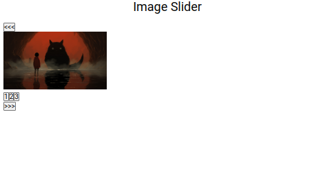

# Image Slider (Image Carousel)

A practice project for the Dynamic User Interactions lesson

## About the Project

### Preview

    

### Live

<a href='http://google.com/'>Google</a>

### Objective

The goal of the project is to learn dynamic user interactions by building an
image slider.

###### Project Statement

<a href='https://www.theodinproject.com/lessons/node-path-javascript-dynamic-user-interface-interactions'>The Odin Project</a> (Jan '24)

### Features

- An image carousel holds a few images
- There are an arrow on the left and an arrow on the right
- The images automatically move forward every 5 seconds
- The slider contains navigation circles at the bottom
- The navigation circles are clickable

## Built With

## To-Do

- [x] Set up repository and core files
- [x] Understand the objectives
- [x] Plan
  - [x] Logic
  - [x] UI: no UI

## Lessons & Difficulties

Some lessons learned along the way

## Diary

Some thoughts regarding the project
